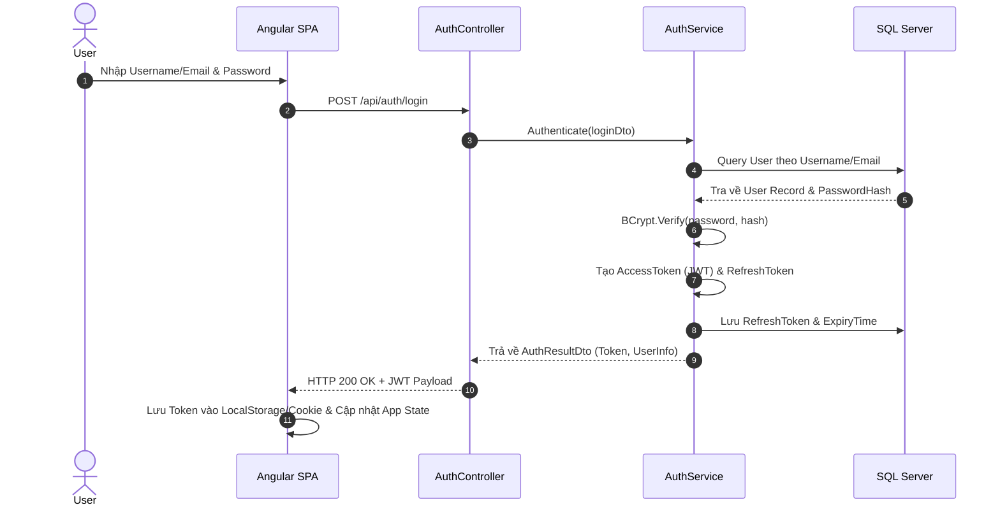
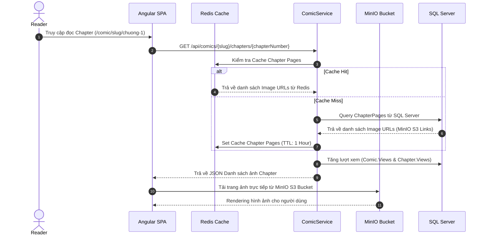
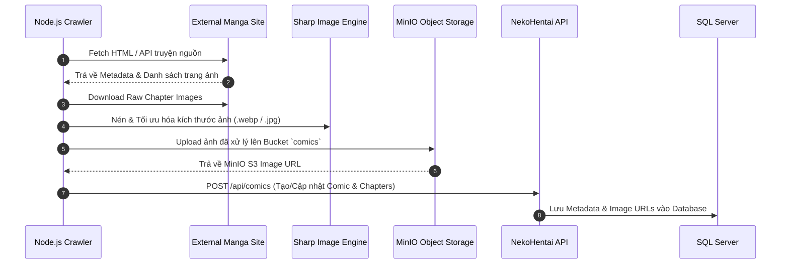

# 🏗️ Kiến Trúc Hệ Thống NekoHentai (Architecture Documentation)

Nền tảng đọc và quản lý truyện tranh trực tuyến **NekoHentai** được thiết kế theo kiến trúc **Multi-tier Client-Server** kết hợp giữa Frontend Single Page Application (SPA), Backend RESTful Web API, Caching Layer, Object Storage và Hệ thống Crawler dữ liệu tự động.

---

## 📌 1. Tổng Quan Kiến Trúc (System Architecture Overview)

```mermaid
graph TD
    subgraph Client Layer
        A[Angular SPA Frontend]
    end

    subgraph Security & Proxy Layer
        B[Cloudflare Tunnel / Reverse Proxy]
    end

    subgraph Application Layer (.NET 10 Web API)
        C[NekoHentai.API]
        C1[Controllers]
        C2[Services Layer]
        C3[JWT Auth & Rate Limiter Middleware]
    end

    subgraph Data & Storage Layer
        D[(MS SQL Server)]
        E[(Redis Cache)]
        F[(MinIO Object Storage)]
    end

    subgraph Data Ingestion Layer
        G[Node.js Crawler Engine + Sharp]
    end

    subgraph Observability & APM Layer
        H[Prometheus Server :9090]
        I[Grafana Dashboards :3000]
    end

    A <-->|HTTP / REST API + JWT| B
    B <--> C
    C --> C3
    C3 --> C1
    C1 --> C2
    C2 <-->|EF Core 9| D
    C2 <-->|Distributed Cache| E
    C2 <-->|MinIO SDK / S3 API| F
    G -->|Extract & Optimize Images| F
    G -->|Push Metadata via REST API| C
    H -->|Scrape /metrics| C
    I -->|Query Data| H
```

---

## 🛠️ 2. Công Nghệ Sử Dụng (Technology Stack)

### **Frontend (Angular)**
* **Framework:** Angular 19 / 18 (Standalone Components, No NgModules).
* **State & Asynchronous Processing:** RxJS, Signals, Services-based State Management.
* **Routing:** Angular Router với Lazy Loading, Route Guards (`authGuard`, `adminGuard`) và Custom Matcher (`chapterUrlMatcher`).
* **Styling:** SCSS / CSS Responsive design.

### **Backend (.NET 10 Web API)**
* **Framework:** ASP.NET Core Web API (.NET 10 / C# 13).
* **ORM:** Entity Framework Core 9 (SQL Server Provider, Auto Migration & Schema Sync).
* **Observability & Metrics:** `prometheus-net.AspNetCore` (`/metrics`), ASP.NET Core Health Checks (`/health`, `/health/ready`, `/health/live`).
* **Security & Authentication:**
  * JWT Bearer Authentication (Access Token & Refresh Token support).
  * BCrypt.Net-Next (Mã hóa mật khẩu).
  * ASP.NET Core Rate Limiting (Fixed Window Limiter chống Spam & Brute-force).
* **Caching:** StackExchangeRedis / DistributedMemoryCache.
* **Object Storage Client:** MinIO C# SDK (S3-compatible).
* **API Documentation:** Swagger / OpenAPI UI.

### **Database, APM & Infrastructure**
* **Primary Database:** Microsoft SQL Server.
* **Caching Server:** Redis Server v7 (Chạy trên Container `nekohentai-redis`).
* **Storage Server:** MinIO Object Storage (Chạy trên Container `nekohentai-minio`).
* **APM & Monitoring:** Prometheus v2.54.1 & Grafana v11.2.0 (`docker-compose.yml`).
* **Containerization:** Docker & Docker Compose (`docker-compose.yml`).
* **Edge Proxy:** Cloudflare Tunnel (`cloudflared`).
* **Load Testing Suite:** k6 (10k VUs) & Node.js Autocannon.

### **Data Crawler Engine**
* **Runtime:** Node.js.
* **Image Processing:** Sharp (Resize, convert, nén ảnh truyện).
* **Client:** MinIO JS Client & Custom HTTP Request Client.

---

## 🏛️ 3. Chi Tiết Các Thành Phần Kiến Trúc (Component Architecture)

### 3.1. Frontend Architecture (`angular/src/app`)

Cấu trúc Frontend được thiết kế theo hướng **Modular Component-driven Design**:

```
src/app/
├── components/          # Standalone Components
│   ├── home/            # Trang chủ (Banner, Truyện nổi bật, Mới cập nhật)
│   ├── comic-list/      # Danh sách truyện tranh + Lọc / Phân trang
│   ├── comic-detail/    # Chi tiết truyện, danh sách chapter, bình luận, đánh giá
│   ├── chapter-read/    # Giao diện đọc truyện (Single page / Continuous scroll)
│   ├── auth/            # Đăng nhập & Đăng ký (Modal / Page)
│   ├── followed/        # Danh sách truyện đang theo dõi
│   ├── history/         # Lịch sử đọc truyện của người dùng
│   ├── profile/         # Quản lý hồ sơ cá nhân
│   ├── admin/           # Admin Dashboard tổng quan
│   ├── admin-stories/   # Quản lý truyện (Thêm/Sửa/Xóa)
│   ├── admin-chapters/  # Quản lý chapter (Upload trang ảnh)
│   └── ...              # Các component thông báo, cài đặt, terms, faq, 404...
├── services/            # Angular Services (API Communication)
│   ├── api.service.ts
│   ├── auth.service.ts
│   ├── comic.service.ts
│   ├── user.service.ts
│   ├── notification.service.ts
│   └── report.service.ts
├── guards/              # Route Protection
│   ├── auth.guard.ts    # Bảo vệ các route yêu cầu đăng nhập
│   └── admin.guard.ts   # Bảo vệ các route Admin
├── interceptors/        # HTTP Interceptors
│   └── jwt.interceptor.ts # Tự động gắn JWT Header & xử lý 401/403
└── models/              # TypeScript Interfaces & DTOs
```

---

### 3.2. Backend Architecture (`backend/NekoHentai.API`)

Backend áp dụng mô hình **Layered Architecture (Controller - Service - Data/Repository)**:

```
NekoHentai.API/
├── Controllers/         # API Endpoint Handlers
│   ├── AuthController.cs                # Login, Register, RefreshToken, Logout
│   ├── ComicsController.cs              # CRUD Comic, Chapters, Comments, Follow, Rating
│   ├── CategoriesAndChaptersController.cs # Thể loại & Chi tiết Chapter
│   ├── UserAndAdminControllers.cs       # Quản lý User, Lịch sử, Thống kê Admin
│   ├── ReportsController.cs             # Báo lỗi chapter / truyện
│   └── UploadController.cs              # Upload ảnh lên MinIO S3
├── Services/            # Core Business Logic Layer
│   ├── AuthService.cs                   # Xử lý Token, RefreshToken, BCrypt Auth
│   ├── ComicService.cs                  # Logic truyện, Chapter, Rating, Comment
│   ├── UserService.cs                   # Logic người dùng, Lịch sử, Follow
│   ├── CacheService.cs                  # Get/Set Distributed Redis Cache
│   ├── MinioStorageService.cs           # Upload/Delete File trên MinIO Bucket
│   ├── NotificationService.cs           # Thông báo hệ thống
│   └── ReportService.cs                 # Xử lý báo lỗi từ độc giả
├── Data/                # Data Access Layer
│   └── MangaDbContext.cs # EF Core DbContext (SQL Server mappings)
├── Models/              # Domain Models / Data Entities
│   ├── User.cs, Comic.cs, Chapter.cs, Category.cs
│   ├── Comment.cs, UserActivity.cs, Notification.cs, Report.cs
├── Middleware/          # Custom Middlewares
│   └── GlobalExceptionHandler.cs        # Catch-all Exception Formatter
├── DTOs/                # Data Transfer Objects
└── Program.cs           # Dependency Injection & Application Pipeline
```

---

### 3.3. Database Schema (Mô Hình Dữ Liệu Quan Hệ)

Các bảng chính trong **SQL Server** (`database/01_CreateDatabase.sql`):

1. **`Users`**: Thông tin người dùng (`Username`, `Email`, `PasswordHash`, `Role`, `RefreshToken`, `RefreshTokenExpiryTime`).
2. **`Comics`**: Thông tin truyện (`Title`, `Slug`, `Author`, `Status`, `Views`, `CoverImage`, `Description`).
3. **`Categories` & `ComicCategories`**: Thể loại và bảng trung gian mối quan hệ N-N giữa Truyện và Thể loại.
4. **`Chapters` & `ChapterPages`**: Thông tin Chapter (`ChapterNumber`, `Title`, `Views`) và danh sách các trang ảnh (`PageIndex`, `ImageUrl`).
5. **`Comments`**: Bình luận của người dùng trên truyện/chapter (Hỗ trợ Like, Reply).
6. **`Follows`**: Danh sách truyện yêu thích / theo dõi của từng User.
7. **`Histories`**: Lịch sử đọc truyện và chapter gần nhất.
8. **`Notifications`**: Thông báo dành cho người dùng (Chapter mới, Phản hồi báo lỗi).
9. **`Reports`**: Phản hồi báo lỗi chapter hỏng / ảnh lỗi từ độc giả.

---

## 🔄 4. Luồng Dữ Liệu Chính (Core Data Flows)

### 4.1. Luồng Xác Thực (Authentication Flow)



---

### 4.2. Luồng Đọc Truyện & Cập Nhật Lượt Xem (Reading & View Counter Flow)



---

### 4.3. Luồng Cào Truyện Tự Động (Crawler Ingestion Flow)



---

## 🔒 5. Chiến Lược Bảo Mật & Hiệu Năng (Security & Performance)

### **Bảo Mật (Security)**
1. **Rate Limiting Policies:**
   - Auth Rate Limiter: Tối đa **5 requests/phút** cho Đăng nhập/Đăng ký.
   - Comment Rate Limiter: Tối đa **10 requests/phút** cho Bình luận/Like.
   - Report Rate Limiter: Tối đa **5 requests/phút** cho Báo lỗi.
2. **JWT Security:** Access Token có thời hạn ngắn, Refresh Token được lưu trữ an toàn trong DB với cơ chế thu hồi (Revocation).
3. **CORS Policy:** Chỉ cho phép các Nguồn gốc được ủy quyền kết nối tới Backend API.
4. **Role-Based Access Control (RBAC):** Middleware kiểm tra quyền `Admin` đối với các thao tác quản trị truyện, thể loại, người dùng.

### **Tối Ưu Hiệu Năng (Performance Optimization)**
1. **Redis Caching:** Lưu Caching các thông tin truy xuất nhiều như Danh sách truyện hot, Danh sách thể loại, Chi tiết chapter để giảm tải SQL Server.
2. **MinIO Object Storage:** Tách biệt lưu trữ tập trung dữ liệu tĩnh (Hình ảnh) khỏi Server API, giúp tối ưu hóa băng thông REST API.
3. **Angular Lazy Loading:** Tất cả các trang ngoài Home Component đều được nạp lười (Lazy Loaded), giảm dung lượng bundle ban đầu.
4. **Image Compression:** Hệ thống crawler dùng `sharp` tối ưu hóa hình ảnh trước khi lưu storage.

---

## 🚀 6. Hướng Dẫn Vận Hành & Khởi Chạy (Operations Guide)

### **1. Khởi chạy Services nền (Docker Compose)**
```bash
docker-compose up -d
```
* **Redis Cache:** `localhost:6379`
* **MinIO Console:** `http://localhost:9001` (User: `nekohentai_admin`, Pass: `NekoHentaiSecretPassword2026!`)

### **2. Khởi chạy Backend Web API (.NET 10)**
```bash
cd backend/NekoHentai.API
dotnet run --environment Production
```
* Swagger UI: `http://localhost:5000/swagger`

### **3. Khởi chạy Frontend (Angular SPA)**
```bash
cd angular
npm run start:prod
# hoặc npm start
```
* Application: `http://localhost:4200`

### **4. Khởi chạy Crawler (Option)**
```bash
cd backend
node crawler.js
```

---
*Tài liệu kiến trúc hệ thống NekoHentai - Cập nhật tự động 2026.*
